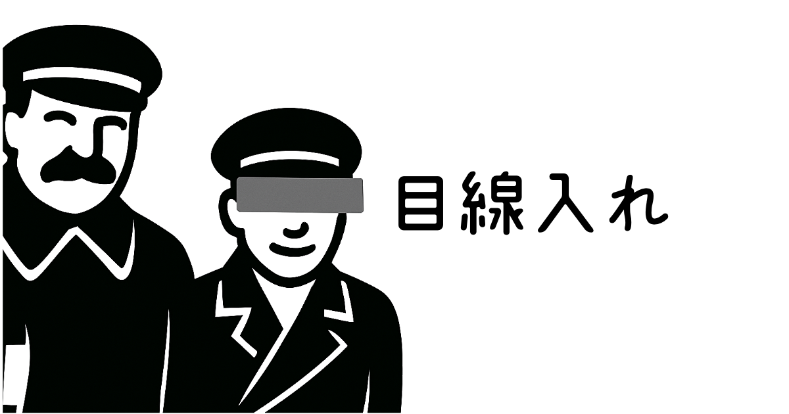

# 目線入れ (Mesen)

画像に目隠し用の線を入れることに特化したシンプルなWebアプリケーション



## 概要

「目線入れ」は、写真や画像に黒い線を描画して、プライバシー保護のための目隠しを簡単に追加できるWebアプリケーションです。Next.jsを使用して構築され、ブラウザ上で完結するため、画像データがサーバーに送信されることはありません。

## 主な機能

- 📸 **画像アップロード**: ローカルから画像を選択
- 🔍 **ルーペ機能**: モバイル環境での精密な描画をサポート
- ✏️ **線の描画**: 直感的な操作で黒い線を描画
- 🔧 **線の太さ調整**: 画像サイズに応じた6段階の太さ（画像最大辺の0.3%, 0.5%, 1%, 2%, 5%, 10%）
- 📏 **拡大・縮小**: マウスホイールやピンチ操作、ダブルタップで画像をズーム
- 🚀 **ドラッグ移動**: 画像の位置を自由に調整
- ↩️ **元に戻す**: 描画した線を1つずつ取り消し
- 💾 **ダウンロード**: 編集後の画像をPNG形式で保存
- 📱 **レスポンシブ対応**: PC・タブレット・スマートフォンに対応
- 📳 **触覚フィードバック**: Vibration API対応デバイスでの振動フィードバック

## 操作方法

### PC環境（マウス操作）
1. **画像の選択**
   - 「画像を選択する」ボタンをクリック
   - ローカルから画像ファイルを選択

2. **線の描画**
   - マウスを0.5秒長押し → ドラッグで線を描画

3. **線の太さ変更**
   - 描画した線をクリックすると太さが順番に変更

4. **画像の操作**
   - ドラッグで画像を移動
   - マウスホイールで拡大・縮小
   - ダブルクリックでズーム（初期スケール時：2.5倍ズーム、拡大時：初期スケールに戻る）

### モバイル環境（タッチ操作）

#### モード遷移システム
1. **移動モード**（デフォルト）
   - 画像のパン・ズーム操作が可能
   - 指を離すと常にこのモードに戻る

2. **調整モード**
   - 0.2秒の長押しで起動
   - ルーペが表示され、タップ位置の微調整が可能
   - ルーペ中心に半透明の黒い円を表示（描画予定位置）
   - 短い振動フィードバック（対応デバイス）

3. **描画モード**
   - 調整モード中、0.5秒間の静止で表示される白いカウントダウンが完了すると起動
   - 1秒間の静止で描画モードに移行
   - ルーペ中心にペンアイコンが一時的に表示（描画可能を視覚的に示す）
   - ルーペ中心の円が不透明に変化し、スケールアニメーションで強調
   - 振動フィードバック（対応デバイス）
   - 指を動かすと線の描画開始

#### ルーペ仕様
- **形状**: 円形（半径50px）
- **拡大率**: 現在のズーム倍率 × 1.5倍
- **表示位置**: 
  - 第1優先: タップ位置の左上
  - 第2優先: 右上
  - 第3優先: 左下
  - 第4優先: 右下
- **中心表示**: 描画する線の太さと同じ大きさの円
  - 調整モード: 半透明の黒
  - 描画モード: 不透明の黒（移行時にスケールアニメーション）
- **線の太さ**: 画面幅の3%に基づいて自動的に最適な太さを選択（ズーム率に応じて調整）

#### カウントダウンインジケーター
- 調整モード中、静止開始から0.5秒後に表示開始
- 白い半透明（透明度30%）の境界線が時計回りに描画
- 0.5秒間で一周完了すると描画モードに移行
- 指が動くと即座にリセット

#### 静止判定システム
- **フレーム間距離**: 1ピクセル以下の移動で静止判定
- **累積距離**: 静止開始位置から3ピクセル以上移動でリセット
- ゆっくりとした移動も確実に検出

#### ズーム操作
- **ピンチズーム**: 2本指でのピンチ・拡張操作
- **ダブルタップズーム**: 
  - 初期スケール時：タップ位置を中心に2.5倍に拡大（滑らかなアニメーション）
  - 拡大時：初期スケールと位置に戻る（滑らかなアニメーション）
  - アニメーション時間：300ms

### 共通操作
- **線の太さ変更**: 描画済みの線をタップ/クリック
- **画像保存**: ダウンロードボタンで編集後の画像を保存
- **編集終了**: 右上の「×」ボタンで編集を終了

### スマートタッチ機能
- **線の上でのタップ**: 線の太さを変更（ダブルタップズームは無効）
- **線の近く（100px以内）でのタップ**: 誤操作防止のため何も起こらない
- **線から離れた場所でのダブルタップ**: ズーム機能が動作
- **複数の線が重なる場合**: 最も近い線が自動選択される

## 技術仕様

### フレームワーク・言語
- **フレームワーク**: Next.js 15.3.3
- **言語**: TypeScript
- **スタイリング**: Tailwind CSS
- **UI**: React 19
- **ビルドツール**: Next.js (SSG)

### API使用
- **Canvas API**: 画像描画・線描画
- **File API**: 画像ファイル読み込み
- **Vibration API**: 触覚フィードバック（対応デバイスのみ）
- **Touch Events**: マルチタッチ・ピンチジェスチャー

## プロジェクト構成

```
mesen-app/
├── app/                      # Next.js App Router
│   ├── globals.css          # グローバルスタイル・アニメーション
│   ├── layout.tsx           # レイアウトコンポーネント
│   └── page.tsx             # メインページ
├── components/              # Reactコンポーネント
│   ├── CanvasEditor.tsx     # メイン画像編集コンポーネント
│   ├── ImageEditor.tsx      # タッチ・マウスイベント制御
│   ├── LandingPage.tsx      # 画像選択ページ
│   └── Loupe.tsx           # ルーペ機能コンポーネント
├── hooks/                   # カスタムフック
│   ├── useDrawing.ts        # 描画ロジック
│   ├── useTouch.ts          # タッチイベント処理
│   └── useZoomPan.ts        # ズーム・パン機能
├── types/                   # TypeScript型定義
│   └── editor.ts            # エディター関連の型
├── constants/               # 定数定義
│   └── editor.ts            # 設定値・閾値
├── public/                  # 静的ファイル
│   ├── favicon.png          # ファビコン
│   └── ogp.png             # OGP画像
├── package.json             # プロジェクト設定
├── tailwind.config.ts       # Tailwind CSS設定
├── tsconfig.json           # TypeScript設定
└── vercel.json             # Vercel設定
```

## 設定可能な定数

`constants/editor.ts`で以下の値を調整可能：

```typescript
export const THICKNESS_RATIOS = [0.003, 0.005, 0.01, 0.02, 0.05, 0.1]  // 画像最大辺に対する太さの比率
export const AUTO_THICKNESS_SCREEN_RATIO = 0.03           // 自動太さ計算用の画面幅に対する比率（3%）
export const ADJUST_MODE_DELAY = 200                       // 調整モード開始時間（ms）
export const DRAW_MODE_DELAY = 1000                        // 描画モード開始時間（ms）
export const MAX_SCALE = 5                                 // 最大ズーム倍率
export const MIN_SCALE = 0.1                               // 最小ズーム倍率
export const CLICK_DISTANCE_THRESHOLD = 5                  // クリック判定距離（px）
export const DOUBLE_TAP_ZOOM_FACTOR = 2.5                  // ダブルタップ時のズーム倍率
export const DOUBLE_TAP_ANIMATION_DURATION = 300           // ダブルタップアニメーション時間（ms）
export const LINE_HIT_EXPANSION = 25                       // 線のタップ判定拡張範囲（px）
export const LINE_ZOOM_EXCLUSION_RADIUS = 100              // 線の周囲でズームを無効化する範囲（px）
```

## セットアップ

### 必要な環境
- Node.js 18以上
- npm または yarn

### インストール

```bash
# リポジトリのクローン
git clone [repository-url]
cd mesen-app

# 依存関係のインストール
npm install
```

### 開発サーバーの起動

```bash
npm run dev
```

ブラウザで [http://localhost:3000](http://localhost:3000) を開く

### ビルド

```bash
npm run build
```

## 開発コマンド

| コマンド | 説明 |
|---------|------|
| `npm run dev` | 開発サーバーの起動 |
| `npm run build` | プロダクションビルド |
| `npm run start` | プロダクションサーバーの起動 |
| `npm run lint` | ESLintの実行 |

## プライバシー・セキュリティ

- **完全クライアントサイド**: すべての画像処理はブラウザ内で完結
- **サーバー送信なし**: 画像データがサーバーに送信されることはありません
- **個人情報保護**: 個人情報の収集は一切ありません
- **セキュアコンテキスト**: Vibration APIはHTTPS環境で動作

## ブラウザ対応状況

| 機能 | Chrome | Safari | Firefox | Edge |
|------|--------|--------|---------|------|
| 基本描画 | ✅ | ✅ | ✅ | ✅ |
| タッチ操作 | ✅ | ✅ | ✅ | ✅ |
| ルーペ機能 | ✅ | ✅ | ✅ | ✅ |
| 振動フィードバック | ✅ | ❌ | ❌ | ✅ |

## パフォーマンス最適化

- **requestAnimationFrame**: 滑らかなアニメーション
- **Canvas最適化**: 差分描画によるパフォーマンス向上
- **メモリ管理**: 適切なクリーンアップ処理
- **イベント最適化**: 必要時のみのイベントリスナー登録

## トラブルシューティング

### 振動が動作しない
- HTTPS接続を確認
- デバイスの振動設定を確認
- ブラウザの通知・振動許可を確認

### ルーペが表示されない
- タッチ操作で0.2秒間の長押しを確認
- ブラウザの開発者ツールでエラーがないか確認

### 描画がずれる
- 画面の向きを変更していないか確認
- ブラウザのズーム設定を100%に設定

## ライセンス

このプロジェクトはMITライセンスの下で公開されています。

## 貢献

Issue や Pull Request は歓迎します。大きな変更を行う場合は、まず Issue を作成して変更内容について議論してください。